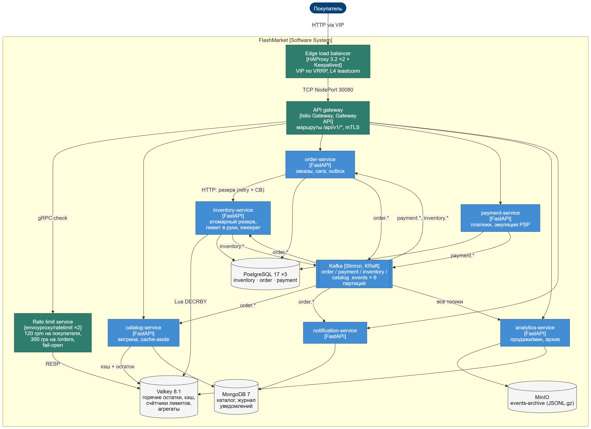

# FlashMarket

Учебный проект по ПрИнж: маркетплейс, который должен выдержать старт Чёрной пятницы. Шесть микросервисов на FastAPI, сага заказа через Kafka, резерв товара без overselling и инфраструктура вокруг: Kubernetes с Cilium, Terraform, Ansible, ArgoCD, Istio, HAProxy с Keepalived, rate limiting и мониторинг на VictoriaMetrics.



## Что где лежит

| Папка | Что внутри |
|---|---|
| `services/` | общий пакет `fm_common` и шесть сервисов, один Dockerfile на всех |
| `helm/` | общий чарт сервиса и values для каждого |
| `gitops/` | приложения ArgoCD (App of Apps) |
| `infra/cluster/` | конфиг kind, values Cilium, сетевые политики |
| `infra/terraform/` | неймспейсы, сервисные аккаунты, секреты |
| `infra/ansible/` | роль `strimzi_kafka` и образ для её запуска |
| `infra/data/` | PostgreSQL, MongoDB, Valkey, MinIO |
| `infra/gateway/` | Istio Gateway и rate limiter |
| `infra/haproxy/` | пара HAProxy + Keepalived |
| `infra/observability/` | values мониторинга, дашборд, алерты |
| `infra/git/` | Gitea и манифест ArgoCD |
| `tests/` | smoke-тест, сценарий Locust, отказы по расписанию, результаты |
| `docs/`, `report/` | ТЗ, требования, диаграммы и графики для отчёта |

## Как поднять

Нужны Docker, kind, kubectl, helm, istioctl.

```bash
kind create cluster --config infra/cluster/kind-config.yaml
helm upgrade --install cilium cilium/cilium -n kube-system -f infra/cluster/cilium-values.yaml
# Terraform и Ansible запускаются в контейнерах в сети kind (kubeconfig: kind get kubeconfig --internal)
docker run --rm --network kind -v $PWD/infra/terraform:/work -w /work hashicorp/terraform:1.13 apply
docker build -t fm-ansible infra/ansible
docker run --rm --network kind -v $PWD/infra/ansible:/work -e K8S_AUTH_KUBECONFIG=/work/kubeconfig fm-ansible \
  ansible-playbook playbook-kafka.yml -e kafka_profile=local
helm upgrade --install data-layer infra/data -n data
istioctl install -y --set profile=minimal
kubectl apply -f infra/gateway/gateway.yaml -f infra/mesh/peer-auth.yaml
docker build -t flashmarket/app:0.1.0 services && kind load docker-image flashmarket/app:0.1.0 --name flashmarket
for s in catalog inventory order payment notification analytics; do
  helm upgrade --install $s-service helm/microservice -n flashmarket -f helm/values/$s-service.yaml
done
bash infra/haproxy/up.sh
```

Проверка:

```bash
docker run --rm --network fm-edge -v $PWD/tests:/t fm-locust python /t/smoke.py http://172.30.0.100
```

## Результаты

Нагрузочный тест на 5 минут с отказами по расписанию: дефицитный товар продан ровно по остатку, circuit breaker снизил ошибки оплаты с 55.8 % до 0.8 %, переключение HAProxy заняло 5 секунд. Подробности и графики есть в отчёте.
