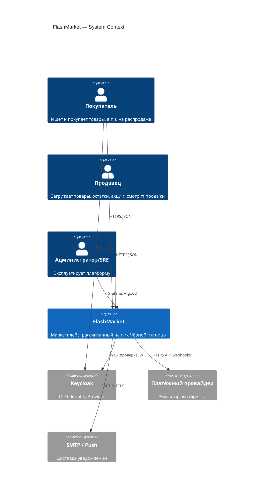
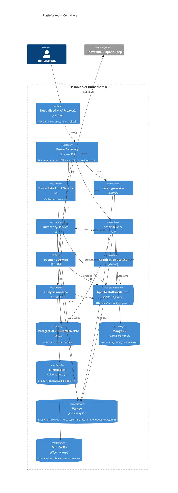
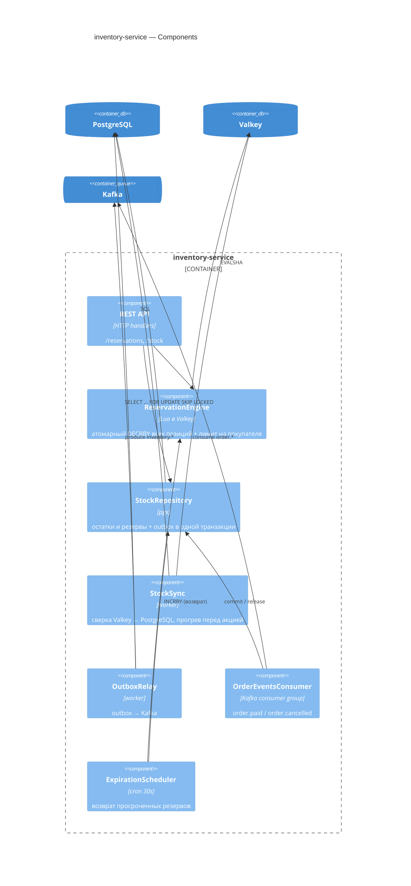
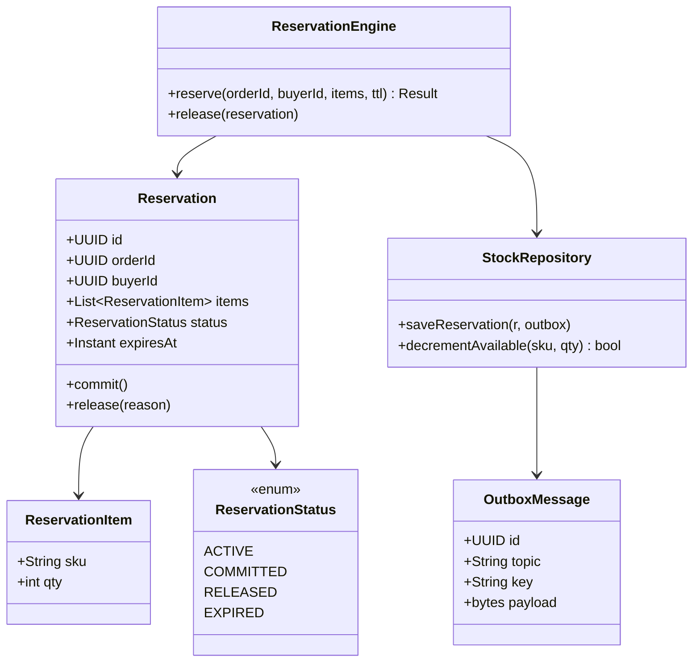
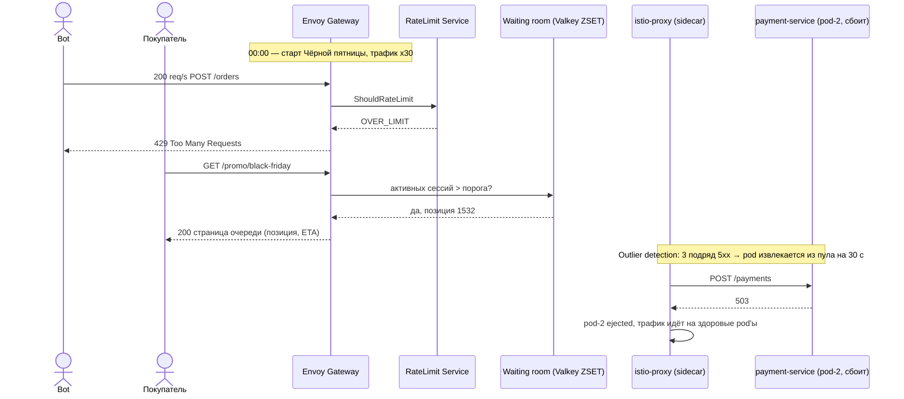

# 3. C4-модель и Sequence-диаграммы

Диаграммы в Mermaid (рендерятся в GitLab/GitHub; для отчёта экспортируются в PNG через mermaid-cli).

> Примечание: модель C4 содержит 4 уровня (Context, Container, Component, Code). В задании указано «L1–L7»; уровни C4 сделаны L1–L4, а дополнительно приведена привязка компонентов к уровням сетевой модели OSI L1–L7 (раздел 3.5) — уточнить у преподавателя, что имелось в виду.

## 3.1 L1 — System Context


## 3.2 L2 — Containers


## 3.3 L3 — Components (inventory-service)


Аналогичные L3 для остальных сервисов — по одному на участника команды (в работе).

## 3.4 L4 — Code (фрагмент inventory-service)


## 3.5 Привязка к уровням OSI (L1–L7)
| OSI | Что в системе |
|---|---|
| L7 Application | Envoy Gateway (HTTP-маршруты, JWT, rate limit, waiting room), Istio VirtualService/retries, Kafka protocol |
| L6 Presentation | TLS 1.3 на входе, mTLS в mesh, JSON/Avro-сериализация |
| L5 Session | HTTP/2 keep-alive, gRPC-стримы (RLS), сессии консьюмер-групп Kafka |
| L4 Transport | HAProxy TCP-mode, Cilium eBPF kube-proxy replacement, outlier detection по TCP-ошибкам |
| L3 Network | Cilium (IP-адресация подов, NetworkPolicy), Keepalived VIP |
| L2 Data link | VRRP (Keepalived) / gratuitous ARP для VIP |
| L1 Physical | узлы кластера (VM/Talos), виртуальные NIC |

## 3.6 Sequence — оформление и оплата заказа (happy path + компенсация)
```mermaid
sequenceDiagram
autonumber
actor U as Покупатель
participant LB as HAProxy (VIP)
participant GW as Envoy Gateway
participant RL as RateLimit (Valkey)
participant O as order-service
participant I as inventory-service
participant V as Valkey
participant PG as PostgreSQL
participant K as Kafka
participant P as payment-service
participant N as notification-service
participant A as analytics-service

U->>LB: POST /api/v1/orders {cart}
LB->>GW: forward
GW->>RL: ShouldRateLimit(ip, user)
RL-->>GW: OK
GW->>O: POST /orders (JWT claims)
O->>I: POST /reservations {items, buyer}
I->>V: EVAL reserve.lua (лимит на покупателя + DECRBY всех SKU)
alt остатка хватает
  V-->>I: OK
  I->>PG: BEGIN; INSERT reservation; INSERT outbox; COMMIT
  I-->>O: 201 reservationId
  O->>PG: INSERT order RESERVED + outbox
  O-->>U: 201 {orderId, payUrl, expiresAt}
  I--)K: inventory.reserved
  O--)K: order.created
else нет в наличии
  V-->>I: OUT_OF_STOCK (частичные списания откатаны в скрипте)
  I-->>O: 409
  O-->>U: 409 Нет в наличии
end
U->>GW: POST /payments (Idempotency-Key)
GW->>P: forward
P->>P: вызов провайдера
alt успех
  P--)K: payment.succeeded
  K--)O: payment.succeeded
  O->>PG: UPDATE order PAID + outbox
  O--)K: order.paid
  K--)I: order.paid → резерв COMMITTED
  K--)N: order.paid → письмо покупателю
  K--)A: order.paid → INSERT ClickHouse
else отказ
  P--)K: payment.failed
  K--)O: payment.failed
  O--)K: order.cancelled
  K--)I: order.cancelled → INCRBY (возврат остатка)
end
```

## 3.7 Sequence — старт распродажи: rate limiter, waiting room, circuit breaker

